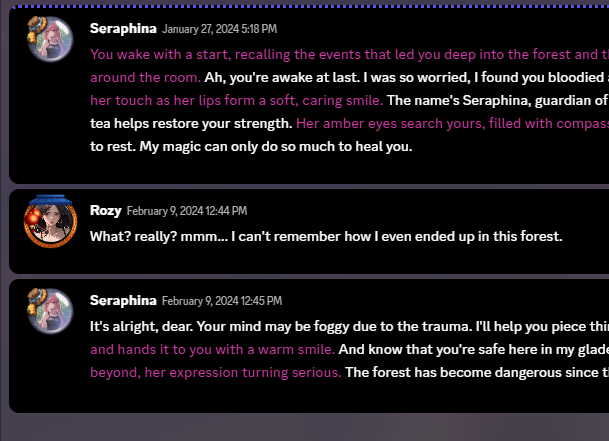
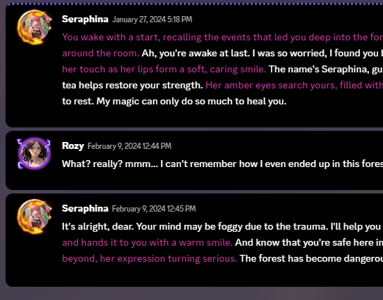
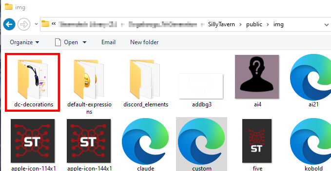
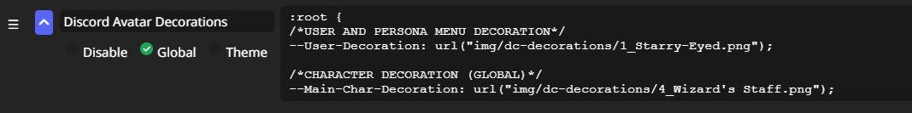
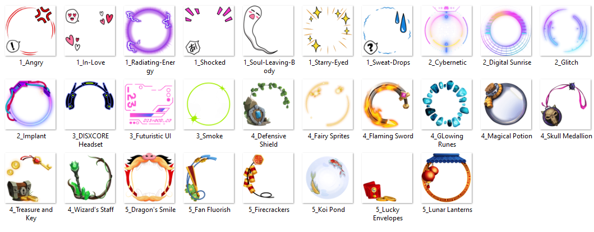

# Avatar Decorations CSS for SillyTavern's Nyx Discord Inspired Theme
This CSS adds Discord Nitro avatar decorations to SillyTavern Discord Inspired Theme (Yes they are animated).

 

# What it does?
Adds animated frames for both User and Character avatars in chat. But there is more, this code also adds the user avatar decoration for the selected Persona inside the Persona Selection menu

# Requirements
The code was made to be used exclusively with Nyx's Discord Inspired Theme (and any compatible variant), it will NOT work correctly with other CSS themes (I will however port this to the default SillyTavern interface at a later time.)

Download Nyx CSS theme from here (https://github.com/nyxkrage/st-discord-inspired) to be used with this, if you're already here I assume you already know your way around installing SillyTavern custom CSS themes and Extensions.

# Recommended Extension
I also suggest you installing LenAnderson's CSS-Snippets Silly Tavern extension (https://github.com/LenAnderson/SillyTavern-CssSnippets), it will make managing CSS code easier.

# How to use
After you download the .zip file, copy the "dc-decorations" folder inside your "public/img" folder which is inside your SillyTavern setup root folder.

Then copy and paste the contents of the "AvatarDecorations.css" file inside SillyTavern's custom CSS box or preferably create a CSS Snippet using CssSnippets extension and paste the CSS code inside.

# How to change User and Character avatar decoration.
You only need to pay attention to these lines at the beginning of the CSS code.

:root {
/*USER AND PERSONA MENU DECORATION*/
--User-Decoration: url("img/dc-decorations/1_Starry-Eyed.png"); 

/*CHARACTER DECORATION (GLOBAL)*/
--Main-Char-Decoration: url("img/dc-decorations/4_Wizard's Staff.png");

}

Comment lines make it self explanatory, just replace the file name of the PNG image with the file name of the decoration you want to use for both the User and Character, I'm providing a preview image so you don't have to navigate to the folder. The first line of code will change the avatar frame for both the User avatar and the selected Persona inside the Persona Menu in both List and Grid mode.

# TO DO LIST
- Add more decorations as Discord releases them.
- Make this a SillyTavern Extension so I can add more funcionality like the ability to set per-character custom decorations, It is possible but not with CSS alone at least not in a non-cumbersome annoying way, that's better achieved with JavaScript and a more elaborated proper Extension, I'm still learning JavaScript and getting around how SillyTavern Extensions work so that might take a while.
